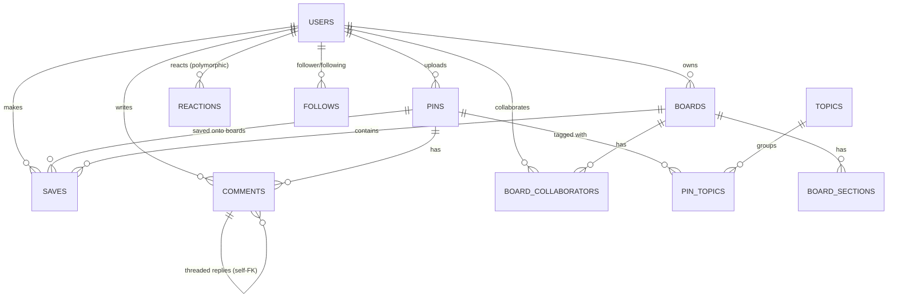
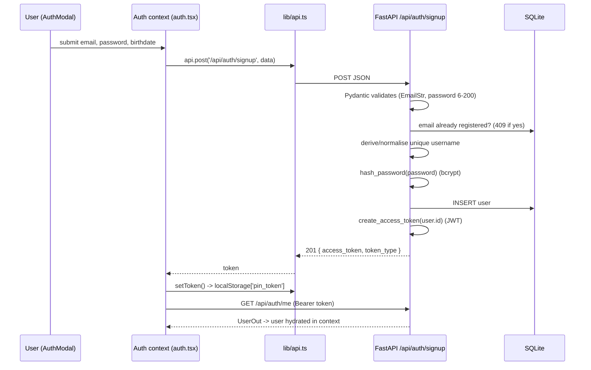

# Pinterest Clone — Technical Deep Dive (Interview Guide)

> A full-stack, full-fidelity Pinterest clone. This document explains **what the code does, how it works end-to-end, the exact tech stack, every dependency (and why), the database schema with relationships, and the complete user-onboarding/auth flow** — written so you can confidently explain any part in an interview.

---

## Table of Contents

1. [Elevator pitch (what to say in 30s / 2min)](#1-elevator-pitch)
2. [Tech stack at a glance](#2-tech-stack-at-a-glance)
3. [High-level architecture & request lifecycle](#3-high-level-architecture)
4. [Dependencies — what each library does & WHY (Python + JS)](#4-dependencies)
5. [Backend deep dive](#5-backend-deep-dive)
6. [Database schema & relationships](#6-database-schema)
7. [Authentication & user-onboarding flow](#7-auth-and-onboarding)
8. [The image pipeline (Pillow / httpx)](#8-image-pipeline)
9. [Frontend deep dive (Next.js / React Query)](#9-frontend-deep-dive)
10. [End-to-end feature flows](#10-end-to-end-flows)
11. [Complete API reference](#11-api-reference)
12. [Key design decisions & trade-offs](#12-design-decisions)
13. [Interview Q&A bank](#13-qa-bank)
14. [Project structure & how to run](#14-run)

---

## 1. Elevator pitch

**30-second version:**

> "I built a full-stack Pinterest clone — a pixel-accurate UI plus a real backend. The frontend is **Next.js 16 + React 19** with **TanStack Query** for data fetching and infinite scroll, and a9. The backend is **FastAPI** with **SQLAlchemy 2.0** over **SQLite**, with **JWT auth** (bcrypt-hashed passwords), and a **Pillow**-based image pipeline that processes every image and extracts a dominant colour for placeholder tiles. It's a real REST API — pins, boards, saves, comments, reactions, follows, search — not mocks."

**2-minute version** — hit these beats:

- **Two services**: a Next.js app (port 3000) and a FastAPI JSON API (port 8000), talking over REST with a **Bearer JWT**.
- **Data model**: 11 tables centred on `users`, `pins`, `boards`, and a `saves` association object (a pin lives on a board *through a save* — that's the "repin" concept).
- **Auth**: stateless JWT (HS256), bcrypt password hashing, a FastAPI dependency (`get_current_user`) that guards protected routes.
- **Images**: seeded from Lorem Picsum, downloaded with httpx, normalised with Pillow (transparency flattening, downscaling, JPEG re-encode), and each gets an average-colour hex stored so the grid shows coloured placeholders while images lazy-load (zero layout shift).
- **Feed**: cursor-based (keyset) pagination + an IntersectionObserver sentinel for infinite scroll; one reusable `PinFeed` component powers Home, Explore, Search, and Profile.
- **Performance detail to flag**: the API serialisers do **batched aggregate counts** to avoid the N+1 query problem.

---

## 2. Tech stack at a glance


| Layer                   | Technology                   | Version        | Role                                             |
| ----------------------- | ---------------------------- | -------------- | ------------------------------------------------ |
| **Frontend framework**  | Next.js (App Router)         | 16.2.7         | SSR/routing, server + client components          |
| **UI library**          | React                        | 19.2.4         | Component rendering                              |
| **Data fetching**       | TanStack Query (React Query) | ^5.101.0       | Caching, infinite scroll, mutations              |
| **Styling**             | Tailwind CSS                 | ^4             | Utility-first CSS (PostCSS plugin, no JS config) |
| **Icons**               | react-icons                  | ^5.6.0         | Pinterest-style SVG icons                        |
| **Language (FE)**       | TypeScript                   | ^5             | Type safety                                      |
| **Backend framework**   | FastAPI                      | 0.115.6        | REST API, validation, dependency injection       |
| **ASGI server**         | Uvicorn (`[standard]`)       | 0.34.0         | Runs the FastAPI app                             |
| **ORM**                 | SQLAlchemy                   | 2.0.36         | Models, queries (2.0 typed style)                |
| **Validation/Settings** | Pydantic / pydantic-settings | 2.10.4 / 2.7.1 | Request/response schemas, env config             |
| **Auth — hashing**      | bcrypt                       | 4.2.1          | Password hashing                                 |
| **Auth — tokens**       | PyJWT                        | 2.10.1         | JWT sign/verify                                  |
| **Image processing**    | Pillow (PIL)                 | 11.1.0         | Decode, normalise, dominant colour               |
| **HTTP client**         | httpx                        | 0.28.1         | Download seed/remote images                      |
| **Uploads**             | python-multipart             | 0.0.20         | Parse `multipart/form-data`                      |
| **Email validation**    | email-validator              | 2.2.0          | Powers Pydantic `EmailStr`                       |
| **Database**            | SQLite (WAL mode)            | built-in       | File-based relational store                      |


**Why this stack:** FastAPI gives async + automatic validation + OpenAPI docs with minimal code; SQLAlchemy 2.0's typed `Mapped[]` models are clean and portable to Postgres later; SQLite needs zero setup for a demo; Next.js + React Query is the modern standard for a fast, cached, infinite-scrolling SPA-like experience.

---

## 3. High-level architecture & request lifecycle

Two independent processes communicate over HTTP/JSON:

```
┌──────────────────────────────┐         REST + JSON          ┌──────────────────────────────┐
│   Next.js 16 (port 3000)     │   Authorization: Bearer JWT  │     FastAPI (port 8000)      │
│                              │ ───────────────────────────► │                              │
│  • App Router pages          │                              │  • Routers (auth/pins/...)   │
│  • React 19 components       │                              │  • Pydantic validation       │
│  • TanStack Query cache      │ ◄─────────────────────────── │  • SQLAlchemy ORM            │
│  • lib/api.ts (fetch wrapper)│        JSON responses        │  • Pillow image pipeline     │
│  • localStorage 'pin_token'  │                              │         │                    │
└──────────────────────────────┘                              │         ▼                    │
            │                                                  │   ┌──────────────┐           │
            │     │   │ SQLite (WAL) │           │
            └────────── images served by FastAPI ────────────►│   │ pinterest.db │           │
                        StaticFiles /uploads                  │   └──────────────┘           │
                                                              └──────────────────────────────┘
```

**Lifecycle of a typical authenticated request** (e.g. loading the feed):

1. A React component calls `api.get("/api/pins/feed?...")` ([frontend/lib/api.ts](frontend/lib/api.ts)).
2. The fetch wrapper reads the JWT from `localStorage["pin_token"]` and adds `Authorization: Bearer <jwt>`.
3. FastAPI matches the route, runs **dependencies** first: `get_db` opens a SQLAlchemy session, `get_current_user_optional` decodes the JWT and loads the user.
4. Pydantic validates query/body params.
5. The handler queries via SQLAlchemy (keyset pagination), then **serialisers** turn ORM rows into JSON dicts (with batched counts + absolute image URLs).
6. FastAPI validates the dict against the `response_model` and returns JSON.
7. React Query caches it by `queryKey`; the masonry renders cards; each `` shows its `dominant_color` background until the JPEG (served from `/uploads`) finishes lazy-loading.

**Key point:** the frontend never talks to the database; all data and all images flow through the FastAPI API.

---

## 4. Dependencies — what each library does & WHY

### 4.1 Python libraries (backend) — `backend/requirements.txt`

These are the **Python libraries you used**, with exactly where and why:


| Library               | Version | What it is                  | Why it's here / where used                                                                                                                                                                                                                              |
| --------------------- | ------- | --------------------------- | ------------------------------------------------------------------------------------------------------------------------------------------------------------------------------------------------------------------------------------------------------- |
| **fastapi**           | 0.115.6 | Async web framework         | The whole API. Routing, dependency injection (`Depends`), automatic request validation, `response_model` serialisation, auto OpenAPI docs at `/docs`.                                                                                                   |
| **uvicorn[standard]** | 0.34.0  | ASGI server                 | Runs the FastAPI app (`uvicorn app.main:app`). `[standard]` pulls in fast extras (uvloop, httptools, websockets).                                                                                                                                       |
| **sqlalchemy**        | 2.0.36  | ORM / SQL toolkit           | All models ([backend/app/models.py](backend/app/models.py)) using the modern **2.0 typed style** (`DeclarativeBase`, `Mapped[]`, `mapped_column`). Engine, sessions, queries.                                                                           |
| **pydantic**          | 2.10.4  | Data validation             | Request/response **schemas** ([backend/app/schemas.py](backend/app/schemas.py)). Validates inbound JSON and shapes outbound JSON.                                                                                                                       |
| **pydantic-settings** | 2.7.1   | Typed config                | `Settings(BaseSettings)` ([backend/app/config.py](backend/app/config.py)) — loads `.env`, gives typed access to `secret_key`, `database_url`, etc.                                                                                                      |
| **bcrypt**            | 4.2.1   | Password hashing            | `hash_password` / `verify_password` ([backend/app/security.py](backend/app/security.py)). Salted, adaptive, one-way.                                                                                                                                    |
| **pyjwt**             | 2.10.1  | JSON Web Tokens             | `create_access_token` / `decode_token`. Signs (HS256) and verifies the auth token carrying the user id.                                                                                                                                                 |
| **pillow**            | 11.1.0  | Image processing (PIL fork) | **The image pipeline** ([backend/app/services/images.py](backend/app/services/images.py)): decode, validate format, flatten transparency, downscale, extract dominant colour, re-encode to JPEG.                                                        |
| **httpx**             | 0.28.1  | HTTP client                 | Downloads images — **sync** `httpx.Client` in the seeder, **async** `httpx.AsyncClient` in the "save from URL" endpoint, and **calls the Pexels API** for topical feed images ([§8.7](#8-image-pipeline)). (No `requests` library — httpx does it all.) |
| **python-multipart**  | 0.0.20  | Multipart parser            | Lets FastAPI parse `multipart/form-data` so users can **upload image files** (`UploadFile`).                                                                                                                                                            |
| **email-validator**   | 2.2.0   | Email syntax check          | Backs Pydantic's `EmailStr` type used in signup/login schemas.                                                                                                                                                                                          |


> **Interview soundbite on Pillow:** "Pillow is the workhorse of the image pipeline. Every image — whether seeded, uploaded, or fetched from a URL — goes through one function that opens it from an in-memory byte stream, validates the format against an allow-list, flattens any transparency onto white (because JPEG has no alpha channel), downscales anything over 1400px, computes an average colour for the placeholder, and re-encodes to optimised JPEG with a UUID filename."

### 4.2 JavaScript/TypeScript libraries (frontend) — `frontend/package.json`


| Package                                    | Version     | Why it's here                                                                                                       |
| ------------------------------------------ | ----------- | ------------------------------------------------------------------------------------------------------------------- |
| **next**                                   | 16.2.7      | App Router framework — file-based routing, server & client components, the dev/build toolchain.                     |
| **react** / **react-dom**                  | 19.2.4      | The UI runtime.                                                                                                     |
| **@tanstack/react-query**                  | ^5.101.0    | Server-state management: caching, `useQuery`, `useInfiniteQuery` (infinite scroll), mutations + cache invalidation. |
| **react-icons**                            | ^5.6.0      | The Pinterest-style icon set (`fi`, `ai`, `fa` families).                                                           |
| **tailwindcss** + **@tailwindcss/postcss** | ^4          | Utility-first styling. v4 is configured via CSS `@theme` (no `tailwind.config.js`).                                 |
| **typescript**                             | ^5          | Static typing across the app.                                                                                       |
| **eslint** / **eslint-config-next**        | ^9 / 16.2.7 | Linting.                                                                                                            |


---

## 5. Backend deep dive

### 5.1 App setup — `backend/app/main.py`

```python
app = FastAPI(title=settings.app_name, lifespan=lifespan)

@asynccontextmanager
async def lifespan(app: FastAPI):
    from . import models            # register models on Base.metadata
    Base.metadata.create_all(bind=engine)   # create tables if missing
    yield

app.add_middleware(CORSMiddleware,
    allow_origins=settings.cors_origins,    # localhost:3000 + 127.0.0.1:3000
    allow_credentials=True, allow_methods=["*"], allow_headers=["*"])

app.mount("/uploads", StaticFiles(directory=settings.upload_dir), name="uploads")

app.include_router(auth.router)      # /api/auth
app.include_router(users.router)     # /api/users
app.include_router(pins.router)      # /api/pins
app.include_router(boards.router)    # /api/boards
app.include_router(comments.router)  # /api
app.include_router(search.router)    # /api
```

- **Lifespan** runs once at startup: it auto-creates tables via `Base.metadata.create_all`. (Seeding is a separate script, **not** automatic.)
- **CORS** is required because the browser app (origin `:3000`) calls the API (origin `:8000`) — a cross-origin request.
- **StaticFiles** mounts the `uploads/` directory at `/uploads`, so processed images are served directly by FastAPI.
- Each router owns its own `prefix`, so `include_router` is called without one.

### 5.2 Config — `backend/app/config.py` (pydantic-settings)

```python
class Settings(BaseSettings):
    model_config = SettingsConfigDict(env_file=BASE_DIR / ".env", extra="ignore")
    app_name: str = "Pinterest Clone API"
    secret_key: str = "dev-secret-change-me"
    algorithm: str = "HS256"
    access_token_expire_minutes: int = 43200          # 30 days
    database_url: str = f"sqlite:///{BASE_DIR/'data'/'pinterest.db'}"
    base_url: str = "http://localhost:8000"
    frontend_origin: str = "http://localhost:3000"
    upload_dir: Path = BASE_DIR / "uploads"
```

- Any field can be overridden by an environment variable or `.env` entry of the same name (e.g. `SECRET_KEY`, `DATABASE_URL`).
- `get_settings()` is `@lru_cache`'d (singleton) and, as a side effect, **creates** the `uploads/` and `data/` directories.

### 5.3 Database layer — `backend/app/database.py`

```python
connect_args = {"check_same_thread": False} if url.startswith("sqlite") else {}
engine = create_engine(settings.database_url, connect_args=connect_args)
SessionLocal = sessionmaker(autocommit=False, autoflush=False, bind=engine)

class Base(DeclarativeBase): pass

@event.listens_for(Engine, "connect")
def _set_sqlite_pragma(dbapi_connection, connection_record):
    cursor = dbapi_connection.cursor()
    cursor.execute("PRAGMA foreign_keys=ON")     # SQLite ignores FKs unless ON
    cursor.execute("PRAGMA journal_mode=WAL")    # Write-Ahead Logging
    cursor.close()

def get_db():
    db = SessionLocal()
    try: yield db
    finally: db.close()
```

Three things worth explaining in an interview:

1. `**check_same_thread=False**` — SQLite forbids using one connection across threads by default; FastAPI serves requests on a threadpool, so we disable that guard (each request still gets its own session).
2. `**PRAGMA foreign_keys=ON**` — **SQLite does not enforce foreign keys unless you turn it on per connection.** We do it in a `connect` event listener so it runs for every new connection — otherwise all our `ON DELETE CASCADE` rules would be silently ignored.
3. `**PRAGMA journal_mode=WAL`** — Write-Ahead Logging lets readers and a writer work concurrently (readers don't block the writer), which matters under FastAPI's concurrency.

`get_db()` is the **per-request session dependency**: yields a session and guarantees `close()` in `finally`.

### 5.4 Serialisation strategy — `backend/app/serializers.py`

A deliberate design choice: **the Pydantic models do *not* use `from_attributes`/`orm_mode`.** Instead, hand-written serialisers build plain dicts. Why? Two reasons:

- **Batched counts (N+1 avoidance):** `serialize_pins(db, pins, viewer)` collects all pin ids, then runs **one** grouped `COUNT` query each for saves, comments, and reactions — instead of 3 queries *per pin*. Uploaders are loaded in one `WHERE id IN (...)` query.
- **Viewer context:** fields like `viewer_has_saved` and `viewer_reaction` depend on *who is asking* — that can't come from a static ORM-attribute mapping.

```python
def serialize_pins(db, pins, viewer=None):
    ids = [p.id for p in pins]
    save_counts     = dict(db.execute(select(Save.pin_id, count()).where(Save.pin_id.in_(ids)).group_by(Save.pin_id)))
    comment_counts  = dict(db.execute(select(Comment.pin_id, count()).where(...).group_by(...)))
    reaction_counts = dict(db.execute(select(Reaction.target_id, count()).where(Reaction.target_type=="pin", ...).group_by(...)))
    # one query for all uploaders; viewer-specific saved-set + reaction-map only if viewer present
    ...
```

`media_url()` ([backend/app/utils.py](backend/app/utils.py)) turns a stored filename into an absolute URL (`{base_url}/uploads/{file}`) but passes through values that are already `http(s)://` — so seed images stored as filenames and external images stored as URLs both work.

---

## 6. Database schema & relationships

**11 tables.** All primary keys are integer. All timestamps default to naive UTC (`utcnow`) on the Python side. FK rules (`CASCADE` / `SET NULL`) are enforced thanks to `PRAGMA foreign_keys=ON`.

### 6.1 Entity-relationship diagram




### 6.2 The relationships in plain English


| Relationship                        | Cardinality                        | Meaning                                                                                                                                                        |
| ----------------------------------- | ---------------------------------- | -------------------------------------------------------------------------------------------------------------------------------------------------------------- |
| User → Pins                         | **1-to-many**                      | A user uploads many pins; each pin has one uploader. Delete user → delete pins (cascade).                                                                      |
| User → Boards                       | **1-to-many**                      | A user owns many boards.                                                                                                                                       |
| User → Saves / Comments / Reactions | **1-to-many**                      | A user makes many saves, writes many comments, leaves many reactions.                                                                                          |
| **Pin ↔ Topic**                     | **many-to-many**                   | Via the `pin_topics` join table. A pin can be in many topics; a topic groups many pins.                                                                        |
| **Save = (User + Pin + Board)**     | **association object**             | The central "repin". A pin appears on a board **through a save**, not via a direct FK. A board's pin-count and cover images are derived from its saves.        |
| Board → Sections                    | **1-to-many**                      | A board has named sub-sections.                                                                                                                                |
| **Board ↔ User (collaborators)**    | **many-to-many**                   | Via `board_collaborators`.                                                                                                                                     |
| **User ↔ User (follows)**           | **many-to-many, self-referential** | `follows(follower_id, following_id)`. Counts derived at read time.                                                                                             |
| Comment → Comment                   | **1-to-many, self-referential**    | `parent_id` enables threaded replies.                                                                                                                          |
| **Reaction → (Pin OR Comment)**     | **polymorphic**                    | `target_type` (`"pin"`/`"comment"`) + `target_id`. **No FK on `target_id`** — resolved in application code. One reaction per `(user, target_type, target_id)`. |


### 6.3 Table-by-table columns (reference)

**users**

`id` PK · `email` (unique, indexed) · `username` (unique, indexed) · `hashed_password` · `full_name` · `avatar` (nullable) · `bio` · `website` · `birthdate` (nullable) · `is_business` (bool) · `created_at`

**pins**

`id` PK · `uploader_id` FK→users (CASCADE) · `title` · `description` (Text) · `alt_text` · `link` · `source_name` · `image` (filename **or** external URL) · `width` · `height` · `dominant_color` (default `#efefef`) · `board_id` FK→boards (**SET NULL**, the origin board) · `created_at` (indexed)

**boards**

`id` PK · `owner_id` FK→users (CASCADE) · `name` · `slug` · `description` · `is_secret` (bool) · `created_at` · *unique(owner_id, slug)*

**saves** (the association object)

`id` PK · `pin_id` FK→pins (CASCADE) · `board_id` FK→boards (CASCADE) · `section_id` FK→board_sections (SET NULL, nullable) · `user_id` FK→users (CASCADE) · `note` · `created_at` (indexed) · *unique(pin_id, board_id)* — can't save the same pin to a board twice

**topics** / **pin_topics**

**topics**: `id` · `name` · `slug` (unique, indexed) · `image` · `category` · `created_at`
**pin_topics**: `id` · `pin_id` FK→pins (CASCADE) · `topic_id` FK→topics (CASCADE) · *unique(pin_id, topic_id)*

**comments** / **reactions** / **follows** / **board_sections** / **board_collaborators**

**comments**: `id` · `pin_id` FK→pins · `user_id` FK→users · `parent_id` FK→comments (self, nullable) · `text` (Text) · `created_at`
**reactions**: `id` · `user_id` FK→users · `target_type` (`pin`/`comment`) · `target_id` (no FK) · `type` (like/heart/applause/wow/idea) · `created_at` · *unique(user_id, target_type, target_id)*
**follows**: `id` · `follower_id` FK→users · `following_id` FK→users · *unique(follower_id, following_id)*
**board_sections**: `id` · `board_id` FK→boards · `name` · `slug` · *unique(board_id, slug)*
**board_collaborators**: `id` · `board_id` FK→boards · `user_id` FK→users · *unique(board_id, user_id)*

---

## 7. Authentication & user-onboarding flow

This is the section most likely to be drilled in an interview. The auth is **stateless JWT**.

### 7.1 Password hashing — bcrypt ([backend/app/security.py](backend/app/security.py))

```python
def hash_password(password: str) -> str:
    pw = password.encode("utf-8")[:72]                 # bcrypt only uses first 72 bytes
    return bcrypt.hashpw(pw, bcrypt.gensalt()).decode("utf-8")

def verify_password(password: str, hashed: str) -> bool:
    try:
        return bcrypt.checkpw(password.encode("utf-8")[:72], hashed.encode("utf-8"))
    except (ValueError, TypeError):
        return False
```

- `**bcrypt.gensalt()**` generates a random salt with the default **cost factor 12** (~2¹² rounds). The salt is embedded in the output hash (`$2b$12$...`), so there's no separate salt column.
- The plaintext is truncated to **72 bytes** because bcrypt ignores anything beyond that; doing it explicitly avoids a `ValueError` on long inputs and keeps hash/verify consistent.
- **Why bcrypt** (not SHA-256 or plaintext): it's deliberately *slow* and *salted*, which defeats rainbow tables and makes brute-forcing a leaked DB impractical. It's one-way — the server never stores or recovers the original password.

### 7.2 JWT — PyJWT ([backend/app/security.py](backend/app/security.py))

```python
def create_access_token(subject: str | int) -> str:
    expire = datetime.now(timezone.utc) + timedelta(minutes=settings.access_token_expire_minutes)
    payload = {"sub": str(subject), "exp": expire, "iat": datetime.now(timezone.utc)}
    return jwt.encode(payload, settings.secret_key, algorithm=settings.algorithm)  # HS256

def decode_token(token: str) -> str | None:
    try:
        payload = jwt.decode(token, settings.secret_key, algorithms=[settings.algorithm])
        return payload.get("sub")                       # the user id as a string
    except jwt.PyJWTError:
        return None
```

- **Claims:** `sub` = the user id (stringified), `exp` = now + 30 days (43200 min), `iat` = issued-at.
- **Algorithm:** **HS256** (symmetric HMAC) — the same `secret_key` signs and verifies.
- `**algorithms=[settings.algorithm]`** pins HS256 on decode, which blocks the classic `alg:none` and algorithm-confusion attacks.
- PyJWT auto-validates `exp`; any failure (expired, bad signature, malformed) is caught as the base `PyJWTError` and returns `None`.

### 7.3 The route guard — `get_current_user` ([backend/app/deps.py](backend/app/deps.py))

```python
bearer_scheme = HTTPBearer(auto_error=False)            # don't auto-401; we handle it

def get_current_user(creds = Depends(bearer_scheme), db = Depends(get_db)) -> User:
    if creds is None:                       raise HTTPException(401, "Not authenticated")
    user_id = decode_token(creds.credentials)
    if user_id is None:                     raise HTTPException(401, "Invalid token")
    user = db.get(User, int(user_id))
    if user is None:                        raise HTTPException(401, "User not found")
    return user
```

- `HTTPBearer` parses the `Authorization: Bearer <token>` header. `auto_error=False` lets the **same scheme** back both a strict guard and an **optional** one (`get_current_user_optional` returns `None` instead of raising — used for public-but-personalised reads like a profile page or the feed).
- Any protected route simply declares `user: User = Depends(get_current_user)`; if the token is bad, the handler body never runs.

### 7.4 Signup flow (end-to-end) — `POST /api/auth/signup`




Backend handler highlights ([backend/app/routers/auth.py](backend/app/routers/auth.py)):

- Rejects duplicate **email** (409) and duplicate **username** (409).
- If no username is given, it's derived from the full name or the email local-part and de-duplicated (`alex`, `alex2`, `alex3`, …).
- Password is bcrypt-hashed; user row inserted; a JWT is minted and returned as `{access_token, token_type:"bearer"}` with **HTTP 201**.

### 7.5 Login flow — `POST /api/auth/login`

```python
user = db.execute(select(User).where(User.email == payload.email)).scalar_one_or_none()
if not user or not verify_password(payload.password, user.hashed_password):
    raise HTTPException(401, "Incorrect email or password")
return Token(access_token=create_access_token(user.id))
```

- One **generic 401** for both "unknown email" and "wrong password" — prevents user-enumeration.
- On success → new JWT.

### 7.6 The frontend half — token storage & hydration

- `**lib/api.ts`** stores the token in `localStorage["pin_token"]` (mirrored in a module variable) and attaches `Authorization: Bearer` to every request.
- `**lib/auth.tsx`** exposes `useAuth()` with `{ user, loading, login, signup, logout, refresh }`. On mount it calls `refresh()`: if a token exists, it fetches `GET /api/auth/me` to hydrate the `user`; on any failure it clears the token (auto-logout of a stale token). `logout()` is purely client-side (clears token + user) — a known trade-off of stateless JWT (no server-side revocation).

---

## 8. The image pipeline (Pillow / httpx)

A favourite interview topic because it touches real Python image libraries.

### 8.1 Where images come from

There are **two** image sources:

1. **Seeded pins** (a fixed starter set) — downloaded once, Pillow-processed, stored **locally** under `/uploads`. Covered in 8.2–8.6.
2. **Dynamically generated pins** (the "infinite, always-fresh feed") — created on-demand with **external image URLs** (no download/processing at request time). Covered in **8.7**.

The **seeder** pulls from **Lorem Picsum** ([backend/seed/seed.py](backend/seed/seed.py)):

```python
url = f"https://picsum.photos/seed/{seed}/{w}/{h}"     # deterministic per seed
```

- Width fixed at **564** (Pinterest's real column width); height cycles through `[520, 600, 680, 760, 840, 940]` — that variety is what creates the staggered **masonry** look.
- The `/seed/` form is deterministic, so re-seeding is reproducible (also `random.seed(42)`).
- If a download fails, there's a Pillow-drawn **gradient fallback** so seeding never breaks.

### 8.2 Pillow processing — `process_image_bytes` ([backend/app/services/images.py](backend/app/services/images.py))

Every image (seed, upload, or URL) goes through this one function:

```python
def process_image_bytes(data: bytes) -> dict:
    img = Image.open(io.BytesIO(data)); img.load()          # 1. decode from memory
    if (img.format or "").upper() not in {"JPEG","PNG","WEBP","GIF"}:
        raise ValueError(...)                               # 2. format allow-list
    if img.mode in ("RGBA","P","LA"):                       # 3. flatten transparency
        bg = Image.new("RGB", img.size, (255,255,255))
        rgb = img.convert("RGBA")
        bg.paste(rgb, mask=rgb.split()[-1])                 #    composite over white
        img = bg
    else:
        img = img.convert("RGB")
    if max(img.size) > 1400:                                # 4. downscale cap
        ratio = 1400 / max(img.size)
        img = img.resize((round(img.width*ratio), round(img.height*ratio)))
    color = _dominant_color(img)                            # 5. placeholder colour
    filename = f"{uuid.uuid4().hex}.jpg"                    # 6. UUID name
    img.save(settings.upload_dir / filename, format="JPEG", quality=85, optimize=True)
    return {"image": filename, "width": img.width, "height": img.height, "dominant_color": color}
```

Step-by-step talking points:

1. `**Image.open(io.BytesIO(data))` + `img.load()**` — open from an in-memory byte stream (no temp file). `open` is lazy; `load()` forces decode so corrupt images fail *here* (→ `ValueError` → HTTP 400).
2. **Format allow-list** `{JPEG, PNG, WEBP, GIF}` — reject anything else.
3. **Flatten transparency onto white** — JPEG has no alpha channel, so an RGBA/palette image is composited over a white canvas using its alpha as the paste mask. Without this, transparent areas would turn black.
4. **Downscale** anything whose longest side > 1400px, preserving aspect ratio.
5. **Dominant colour** (below).
6. **Save** as optimised JPEG (`quality=85`) under a `uuid4().hex + ".jpg"` filename.

### 8.3 The dominant-colour algorithm (and the honest caveat)

```python
def _dominant_color(img):
    small = img.convert("RGB").resize((1, 1))   # collapse whole image to ONE pixel
    r, g, b = small.getpixel((0, 0))
    return f"#{r:02x}{g:02x}{b:02x}"            # e.g. (239,12,8) -> "#ef0c08"
```

- Resizing the entire image to **1×1** makes Pillow's resampler **average** all pixels into one — so this is the image's **mean colour**, returned as a CSS hex.
- **Why:** the hex is stored on the pin and sent to the frontend, which paints it as the tile's **background while the JPEG lazy-loads** → coloured placeholders (Pinterest's signature) and **zero layout shift**.
- **Honest caveat (good to volunteer):** the function is named `_dominant_color` but it's really an *average*, not a true most-frequent colour (no quantisation/histogram). Fine for a placeholder tint — but if asked "is that really the dominant colour?", the correct answer is "it's the average via a 1×1 resize; a true dominant colour would use `quantize()` or a colour histogram."

### 8.4 Upload vs. Save-from-URL — `POST /api/pins` ([backend/app/routers/pins.py](backend/app/routers/pins.py))

One endpoint, two image sources (multipart form):

```python
if file is not None:
    data = await file.read()                                # uploaded file (python-multipart)
elif image_url:
    async with httpx.AsyncClient() as client:               # fetch a remote URL server-side
        resp = await client.get(image_url, timeout=20, follow_redirects=True)
        resp.raise_for_status(); data = resp.content
else:
    raise HTTPException(400, "Provide an image file or image_url")
meta = process_image_bytes(data)                            # same pipeline for both
pin = Pin(uploader_id=user.id, ..., **meta)
```

Both paths converge on `process_image_bytes`, so a URL image is downloaded, processed, and stored **locally** as a UUID JPEG (not kept as a remote link). If a `board_id` is supplied, a `Save` row is also written so the new pin appears on that board.

### 8.5 Serving — StaticFiles + download endpoint

- Images are served by FastAPI at `/uploads/<file>` (`StaticFiles` mount). `media_url()` builds the absolute URL.
- `GET /api/pins/{id}/download` returns a `FileResponse` with a `filename=` (which sets `Content-Disposition: attachment`) to force a real download, or `RedirectResponse` if the image is external.

### 8.6 Seed data (the demo dataset) — `backend/seed/seed.py`

- **5 users**, **12 topics**, **60 pins** (each topic gets 5), **15 boards** (3 per user), plus random saves, comments, reactions, and follows. Deterministic (`random.seed(42)`).
- **Demo login:** `alex@demo.com` / `**password123`** (all five demo users share that password). Others: `sara@demo.com`, `mike@demo.com`, `nina@demo.com`, `leo@demo.com`.

### 8.7 Dynamic, infinite feed — on-demand pin generation ([backend/app/services/feed_generator.py](backend/app/services/feed_generator.py))

The seed set is finite. To make the feed feel **infinite and different on every refresh** — like real Pinterest — the API **generates a fresh batch of pins on each first-page load**.

**The design problem (great to explain in an interview):** the naïve idea is "just render a random image URL each time." But pins must stay **persistent** — each one needs a detail page (`/pin/{id}`), must be **saveable** to a board, and **commentable**. A throwaway random URL would 404 on click and break Save. So instead of throwing images on screen, we **mint real, persisted `Pin` rows** — but back them with **external image URLs** so there's no download/processing cost at request time (the browser loads the image straight from the source).

**How "fresh every refresh" + "infinite scroll" coexist with stable cursors:**

```python
# backend/app/routers/pins.py
def feed(cursor=None, limit=25, ...):
    if not cursor:              # only the FIRST page mints new pins
        generate_pins(db, 30)   # 30 brand-new rows, newest ids
    stmt = select(Pin).order_by(Pin.id.desc()).limit(limit + 1)   # newest-first
    ...
```

- A **refresh** (no cursor) generates 30 new pins with the highest ids; ordering by `Pin.id DESC` puts them on top → you see new images every time.
- **Infinite scroll** sends `?cursor=<last id>` for later pages, which **don't** generate — they just page back through the existing pool. So cursors stay stable and there are no duplicates.
- It's **everywhere**: the same `generate_pins` call is wired into the **home/explore feed** (`/api/pins/feed`), **search** (`/api/search/pins`), and **topic pages** (`/api/topics/{slug}/pins`).

**The generator** (`generate_pins`) — cheap, no network on the default path:

```python
def generate_pins(db, count=30, *, topics=None, query=None, topical=False, title=None):
    user_ids = db.execute(select(User.id)).scalars().all()
    if topics is None:                                   # home feed -> random topic spread
        topics = db.execute(select(Topic).order_by(func.random()).limit(6)).scalars().all()
    photos = _pexels_photos(query, count) if topical else []   # only if a key is set
    for i in range(count):
        topic = topics[i % len(topics)] if topics else None
        if i < len(photos):                              # topical (Pexels) image
            image, w, h, color = photos[i]["url"], ..., photos[i]["color"]
        else:                                            # keyless (Picsum) image
            seed = f"dyn-{uuid.uuid4().hex[:12]}"        # unique seed -> unique, STABLE image
            w, h = 564, random.choice([520,600,680,760,840,940])
            image = f"https://picsum.photos/seed/{seed}/{w}/{h}"
            color = _synth_color(seed)                   # deterministic pastel placeholder
        pin = Pin(uploader_id=random.choice(user_ids), image=image, width=w, height=h,
                  dominant_color=color, title=..., alt_text=...)
        db.add(pin); db.flush()                          # flush -> get pin.id
        if topic: db.add(PinTopic(pin_id=pin.id, topic_id=topic.id))  # tag for search/topics
    db.commit(); _prune(db)
```

Key points to call out:

- **Unique, deterministic seeds** — `picsum.photos/seed/{uuid}` gives every pin a *different* image, but the `/seed/` form is *stable*, so re-opening a pin always shows the same photo (essential for a persistent pin).
- **Placeholder colour without downloading** — since we never fetch the bytes, we can't compute a true average colour; `_synth_color` hashes the seed into a soft pastel hex (Pexels, by contrast, returns a real `avg_color`, which we use when present).
- **Topic tagging** — each generated pin is linked to a `Topic` via `pin_topics`, so it's reachable through search and topic pages (not just the home feed).
- **Bounded growth** — `_prune()` caps accumulation (~1200 generated pins) by deleting the oldest generated pins **that nobody saved** (identified by `image LIKE 'http%'` and absent from `saves`), so saved/commented pins are never destroyed.

**Image source — keyless by default, topical on demand:**


|                          | Default (no key)                        | With `PEXELS_API_KEY`                                                     |
| ------------------------ | --------------------------------------- | ------------------------------------------------------------------------- |
| **Home / Explore feed**  | Lorem Picsum (varied, mixed topics)     | Lorem Picsum (kept fast & mixed)                                          |
| **Search & Topic pages** | Lorem Picsum, tagged to the right topic | **Pexels search** — real topical photos (search "dress" → actual fashion) |
| **Setup**                | none — works immediately                | drop a free key in `.env`                                                 |
| **Cost at request time** | zero network (just DB inserts)          | one Pexels call per first page                                            |


`_pexels_photos()` is wrapped in a broad `try/except` returning `[]`, so a missing key, rate-limit, or network blip silently **falls back to Picsum** — image sourcing can never break the feed.

> **Interview soundbite:** "The feed is infinite and fresh on every refresh, but pins are still real persistent rows — so they stay clickable, saveable and commentable. I mint a batch of pins backed by external image URLs only on the first page; later pages paginate by keyset cursor, so it never duplicates or breaks. It's keyless out of the box via Lorem Picsum, and becomes topical on search/topic pages the moment you add a free Pexels key — with an automatic fallback if the key's missing."

---

## 9. Frontend deep dive

### 9.1 App Router & component model

- **Next.js 16 App Router**: `app/layout.tsx` is a **Server Component** that wraps everything in `<Providers>` + `<AppShell>`. Pages like `app/page.tsx` (home), `app/explore/page.tsx`, `app/pin/[id]/page.tsx` are thin — they mostly render a feed/view component.
- The pin route is an **async server component** that `await`s `params` (a Promise) — a newer Next.js 16 convention.

### 9.2 Provider tree — `lib/providers.tsx`

```
QueryClientProvider  →  AuthProvider  →  ToastProvider  →  ModalProvider  →  children
```

The `QueryClient` is created once (lazy `useState`) with defaults: `staleTime: 30s`, `refetchOnWindowFocus: false`, `retry: 1`.

### 9.3 The API wrapper & token flow — `lib/api.ts`

```ts
const token = getToken();                                  // memory -> localStorage['pin_token']
if (token) headers["Authorization"] = `Bearer ${token}`;
const isForm = options.body instanceof FormData;           // FormData -> let browser set boundary
// else JSON.stringify + Content-Type: application/json
if (!res.ok) { /* parse FastAPI {detail} */ throw new ApiError(res.status, detail); }
if (res.status === 204) return null;
return res.json();
```

- FormData bodies are sent **without** a manual Content-Type (so the browser sets the multipart boundary) — that's what makes file uploads work.
- Errors become a typed `ApiError(status, detail)` carrying the FastAPI `detail` message.

### 9.4 Infinite scroll — `components/PinFeed.tsx`

The single reusable feed engine (used by Home, Explore, Search, Profile). `**useInfiniteQuery` (cursor pagination) + an IntersectionObserver sentinel:**

```tsx
useInfiniteQuery({
  queryKey,
  queryFn: ({ pageParam }) => api.get<PinPage>(`${endpoint}?limit=25${pageParam ? `&cursor=${pageParam}`:""}`),
  initialPageParam: 0,
  getNextPageParam: (last) => last.next_cursor ?? undefined,   // undefined => hasNextPage=false
});

const observer = new IntersectionObserver(([e]) => {
  if (e.isIntersecting && hasNextPage && !isFetchingNextPage) fetchNextPage();
}, { rootMargin: "1000px" });                                  // prefetch 1000px early
observer.observe(sentinelRef.current);

const pins = data?.pages.flatMap(p => p.items) ?? [];          // flatten pages
```

- `**rootMargin: "1000px"**` triggers the next fetch *before* the user hits the bottom → no visible loading gap.
- The triple guard prevents duplicate fetches.

### 9.5 Masonry — `components/MasonryGrid.tsx` + `globals.css`

```tsx
<div style={{ columnWidth: "216px", columnGap: "16px" }}>{children}</div>
```

```css
.masonry-item { break-inside: avoid; -webkit-column-break-inside: avoid; page-break-inside: avoid; }
```

- **Pure CSS multi-column** masonry — no JS layout library. With `column-width` set and `column-count` auto, the browser computes `floor((width + gap) / (colWidth + gap))` columns, then **stretches** them to fill.
- `**break-inside: avoid`** stops a card from being sliced across two columns — the one rule that makes column-masonry work.
- Trade-off to mention: cards flow top→bottom then column→column (column-major), so it doesn't perfectly balance column heights like a JS algorithm would — but it's far cheaper and fully responsive with zero media queries.

### 9.6 PinCard — colour placeholder & no layout shift

```tsx

```

- `**aspectRatio**` from the stored dimensions reserves the correct height *before* the image loads → the masonry doesn't reflow as images arrive.
- `**backgroundColor: dominant_color`** is the coloured placeholder behind the loading image.
- `**loading="lazy"*`* defers offscreen images.

### 9.7 The layout shell — `AppShell` / `LeftRail` / `RailPanel`

`AppShell` keeps `RAIL_W = 72`, `PANEL_W = 368`. The content's `padding-left` animates `0 → 72 → 440` so the slide-in Updates/Messages/Settings panels **push the feed** (which re-flows into the narrower space) instead of covering it — backed by a `slidein-left` keyframe.

---

## 10. End-to-end feature flows

**A. Load the home feed**
`Home page` → `PinFeed` `useInfiniteQuery` → `GET /api/pins/feed?limit=25` → backend keyset query `ORDER BY Pin.id DESC LIMIT 26` (fetch one extra to know if there's a next page) → `serialize_pins` (batched counts + `media_url`) → `{items, next_cursor}` → React Query caches → masonry renders → each card shows `dominant_color` until its `/uploads/<uuid>.jpg` lazy-loads. Scrolling near the bottom trips the observer → `fetchNextPage` with `cursor=<last id>`.

**B. Create a pin**
`CreatePin` builds `FormData` (file *or* `image_url` + title/board) → `POST /api/pins` → backend reads bytes (multipart) or fetches the URL (httpx) → `process_image_bytes` (Pillow) → insert `Pin` → if board chosen, insert `Save` → returns `PinOut` → redirect to `/pin/{id}`.

**C. Save a pin to a board**
`PinCard`/`PinDetail` "Save" → `BoardPickerModal` → `POST /api/pins/{id}/save {board_id}` → backend checks the board belongs to the user (403 otherwise), dedupes against the `unique(pin_id, board_id)` constraint, inserts a `Save` → re-serialised pin (now `viewer_has_saved: true`). Counts are derived at read time, never stored.

**D. Search**
`/search?q=dress` → `GET /api/search/pins?q=dress` → backend `ILIKE` across title/description/alt_text **plus** topic matching expanded via `SEARCH_ALIASES` (e.g. `dress → fashion`), pulling pins through the `pin_topics` join → same cursor pagination. `GET /api/search/suggestions` powers the chips.

---

## 11. Complete API reference

> Auth: **R** = requires JWT (`get_current_user`), **O** = optional (personalises if present), **—** = public.

### Auth — `/api/auth`


| Method | Path               | Auth | Body / Params                                             | Returns                          |
| ------ | ------------------ | ---- | --------------------------------------------------------- | -------------------------------- |
| POST   | `/api/auth/signup` | —    | email, password(6–200), full_name?, username?, birthdate? | 201 `{access_token, token_type}` |
| POST   | `/api/auth/login`  | —    | email, password                                           | `{access_token, token_type}`     |
| GET    | `/api/auth/me`     | R    | —                                                         | `UserOut`                        |


### Users — `/api/users`


| Method        | Path                                  | Auth | Returns                                    |
| ------------- | ------------------------------------- | ---- | ------------------------------------------ |
| PATCH         | `/api/users/me`                       | R    | `UserProfile`                              |
| GET           | `/api/users/{username}`               | O    | `UserProfile` (+ `is_following`)           |
| GET           | `/api/users/{username}/boards`        | O    | `BoardBrief[]` (hides secret unless owner) |
| GET           | `/api/users/{username}/boards/{slug}` | —    | `BoardOut`                                 |
| GET           | `/api/users/{username}/pins`          | O    | `PinPage`                                  |
| GET           | `/api/users/{username}/saved`         | O    | `PinPage` (cursor over `Save.id`)          |
| POST / DELETE | `/api/users/{username}/follow`        | R    | 204                                        |


### Pins — `/api/pins`


| Method         | Path                      | Auth | Returns                                      |
| -------------- | ------------------------- | ---- | -------------------------------------------- |
| GET            | `/api/pins/feed`          | O    | `PinPage`                                    |
| POST           | `/api/pins`               | R    | 201 `PinOut` (multipart: file? / image_url?) |
| GET            | `/api/pins/{id}`          | O    | `PinOut`                                     |
| GET            | `/api/pins/{id}/related`  | O    | `PinPage`                                    |
| GET            | `/api/pins/{id}/download` | —    | file / redirect                              |
| PATCH / DELETE | `/api/pins/{id}`          | R    | `PinOut` / 204 (owner only)                  |
| POST / DELETE  | `/api/pins/{id}/save`     | R    | `PinOut`                                     |
| POST / DELETE  | `/api/pins/{id}/react`    | R    | `PinOut`                                     |


### Boards — `/api/boards`


| Method         | Path                        | Auth  | Returns                           |
| -------------- | --------------------------- | ----- | --------------------------------- |
| POST           | `/api/boards`               | R     | 201 `BoardOut`                    |
| GET            | `/api/boards/{id}`          | —     | `BoardOut`                        |
| PATCH / DELETE | `/api/boards/{id}`          | R     | `BoardOut` / 204 (owner)          |
| GET            | `/api/boards/{id}/pins`     | O     | `PinPage` (cursor over `Save.id`) |
| GET / POST     | `/api/boards/{id}/sections` | — / R | `SectionOut[]` / 201 `SectionOut` |


### Comments & Search — `/api`


| Method        | Path                         | Auth  | Returns                           |
| ------------- | ---------------------------- | ----- | --------------------------------- |
| GET / POST    | `/api/pins/{id}/comments`    | O / R | `CommentOut[]` / 201 `CommentOut` |
| DELETE        | `/api/comments/{id}`         | R     | 204 (author)                      |
| POST / DELETE | `/api/comments/{id}/react`   | R     | `CommentOut`                      |
| GET           | `/api/search/pins?q=`        | O     | `PinPage`                         |
| GET           | `/api/search/suggestions?q=` | —     | `string[]`                        |
| GET           | `/api/topics`                | —     | `TopicOut[]`                      |
| GET           | `/api/topics/{slug}/pins`    | O     | `PinPage`                         |
| GET           | `/api/explore`               | —     | `TopicOut[]` (20 random)          |


**Pagination (all list endpoints):** cursor/keyset — `cursor: int?`, `limit: int = 25` (clamped 1–50). Fetch `limit+1`, trim, set `next_cursor` to the last key. Cursor key = `Pin.id` (pin queries) or `Save.id` (save-driven queries).

---

## 12. Key design decisions & trade-offs


| Decision                                                | Why                                                                                                                         | Trade-off                                                                                                                             |
| ------------------------------------------------------- | --------------------------------------------------------------------------------------------------------------------------- | ------------------------------------------------------------------------------------------------------------------------------------- |
| **SQLite + WAL**                                        | Zero-setup, single file, great for a demo; WAL gives reader/writer concurrency.                                             | Not for high write concurrency; would move to Postgres in prod (the SQLAlchemy models port cleanly).                                  |
| **Cursor (keyset) pagination**                          | Stable under inserts, O(1) per page (`WHERE id < cursor LIMIT n`), no deep-offset scan.                                     | Can't jump to "page 50" directly — fine for an infinite feed.                                                                         |
| **Hand-written serialisers (no `orm_mode`)**            | Enables **batched aggregate counts** (no N+1) and viewer-specific fields.                                                   | More code than ORM-attribute mapping.                                                                                                 |
| **Stateless JWT**                                       | No server session store; scales horizontally.                                                                               | No built-in revocation; long 30-day expiry + no refresh token is a security trade-off (would shorten + add refresh in prod).          |
| **Store *uploaded* images locally**                     | Consistent processing, stable URLs, works offline.                                                                          | Storage grows; a CDN/object store would be the prod choice.                                                                           |
| **Generate feed pins on-demand w/ external image URLs** | Infinite + fresh-every-refresh feed while keeping pins persistent (clickable/saveable); zero download cost at request time. | DB grows (mitigated by pruning); depends on the image host (Picsum/Pexels) being up; placeholder colour is synthetic for Picsum pins. |
| **CSS-column masonry**                                  | Cheap, responsive, no JS layout cost.                                                                                       | Column-major order doesn't perfectly balance heights.                                                                                 |
| **Average colour placeholder**                          | Eliminates layout-shift flash, mimics Pinterest.                                                                            | It's a mean, not a true dominant colour (named slightly optimistically).                                                              |
| **bcrypt**                                              | Salted, slow, adaptive, battle-tested.                                                                                      | CPU cost per login (intentional).                                                                                                     |


---

## 13. Interview Q&A bank

**Q: Walk me through what happens when the page loads the feed.**
→ See [Flow A](#10-end-to-end-flows). Emphasise: cursor query fetching `limit+1`, batched-count serialisation, colour placeholders, observer-driven prefetch.

**Q: How does authentication work?**
→ Bcrypt-hashed passwords; on login/signup the server mints an HS256 JWT with `sub=user.id` and a 30-day `exp`; the client stores it in localStorage and sends `Authorization: Bearer`; a FastAPI dependency (`get_current_user`) decodes it and loads the user, raising 401 otherwise. It's stateless — no session table.

**Q: Why bcrypt and not SHA-256?**
→ Fast hashes are brute-forceable; bcrypt is deliberately slow and per-password salted (cost factor 12), so a leaked DB is impractical to crack. Also note the 72-byte truncation detail.

**Q: How do you avoid N+1 queries?**
→ The list serialiser collects all pin ids and runs one grouped `COUNT` per metric (saves/comments/reactions) and one `IN (...)` query for uploaders — instead of querying per pin.

**Q: How does the masonry work without a JS library?**
→ CSS `column-width` + `column-gap`; the browser computes the column count and stretches to fill; `break-inside: avoid` keeps each card intact. `aspect-ratio` on the image reserves height so there's no reflow as images load.

**Q: What does Pillow actually do here?**
→ Decode from a byte stream, validate the format, flatten transparency onto white (JPEG has no alpha), downscale to ≤1400px, compute an average colour via a 1×1 resize, and re-encode to optimised JPEG with a UUID name. (Volunteer the "it's an average, not a true dominant colour" nuance.)

**Q: Why cursor pagination over `LIMIT/OFFSET`?**
→ OFFSET scans and discards rows (slow for deep pages) and skips/duplicates rows when items are inserted; keyset (`WHERE id < cursor`) is stable and constant-time.

**Q: How is the feed "infinite" and different every refresh without breaking pins?**
→ On the **first page only**, the API mints a batch of ~30 real, persisted `Pin` rows backed by **external image URLs** (Lorem Picsum by default), then returns newest-first. So a refresh shows new images, but the pins are real — clickable, saveable, commentable. Later pages paginate by keyset cursor and don't generate, so cursors stay stable with no duplicates. Generated pins are topic-tagged (so they show in search/topic pages too) and pruned when they pile up. Add a free Pexels key and search/topic images become genuinely topical, with an automatic Picsum fallback. (See [§8.7](#8-image-pipeline).)

**Q: Why does SQLite need a pragma for foreign keys?**
→ SQLite doesn't enforce FKs unless `PRAGMA foreign_keys=ON` is set per connection; we do it in a `connect` event listener, otherwise the cascade rules would be silently ignored.

**Q: How is a "save" modelled?**
→ As an association object linking user + pin + board (+ optional section), with a unique constraint on `(pin_id, board_id)`. A pin appears on a board *through* a save — board pin-counts and covers are derived from saves.

**Q: What would you change for production?**
→ Postgres instead of SQLite; object storage/CDN for images; shorter JWT expiry + refresh tokens (and a revocation list); rate limiting; background workers for image processing; real full-text search (Postgres FTS / OpenSearch) instead of `ILIKE`.

---

## 14. Project structure & how to run

```
Clone/
├── backend/
│   ├── app/
│   │   ├── main.py            # FastAPI app, CORS, static mount, routers
│   │   ├── config.py          # pydantic-settings
│   │   ├── database.py        # engine, session, WAL/FK pragmas
│   │   ├── deps.py            # get_current_user(_optional)
│   │   ├── security.py        # bcrypt + JWT
│   │   ├── models.py          # 11 SQLAlchemy models
│   │   ├── schemas.py         # Pydantic request/response models
│   │   ├── serializers.py     # ORM -> JSON (batched counts)
│   │   ├── utils.py           # media_url, slugify
│   │   ├── routers/           # auth, users, pins, boards, comments, search
│   │   └── services/
│   │       ├── images.py          # Pillow pipeline (seed/upload processing)
│   │       └── feed_generator.py   # on-demand pin generation (infinite feed)
│   ├── seed/                  # seed.py (Picsum + Pillow), data.py (pools)
│   ├── requirements.txt
│   └── .env(.example)
└── frontend/
    ├── app/                   # App Router pages + layout + globals.css
    ├── components/            # PinFeed, MasonryGrid, PinCard, AppShell, ...
    ├── lib/                   # api.ts, auth.tsx, providers.tsx, types.ts, ...
    ├── package.json
    └── .env.local(.example)
```

**Run the backend:**

```bash
cd backend
python -m venv .venv && source .venv/bin/activate
pip install -r requirements.txt
cp .env.example .env
python -m seed.seed          # seeds 5 users / 60 pins / 12 topics (Picsum + Pillow)
uvicorn app.main:app --reload   # http://localhost:8000  (docs at /docs)
```

**Run the frontend:**

```bash
cd frontend
npm install
cp .env.example .env.local
npm run dev                  # http://localhost:3000
```

**Demo login:** `alex@demo.com` / `password123`

---

*Generated as an interview-prep companion. Every code snippet above is from the actual source — verify any detail against the linked files before quoting it.*